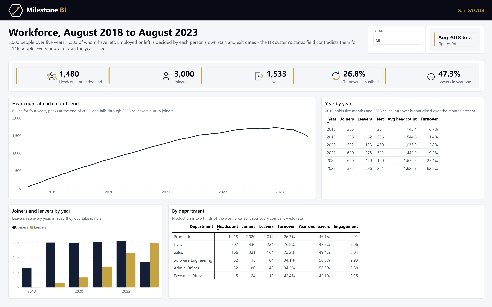
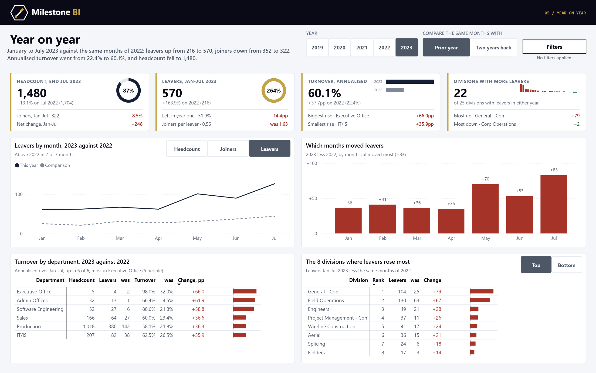
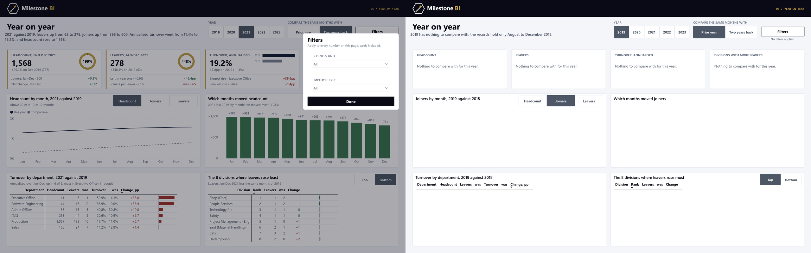

# Workforce analytics - a Power BI model you can review

Five years of an organisation's HR records - 3,000 people, August 2018 to August 2023 - rebuilt
as a Power BI star schema: headcount, joiners and leavers, turnover, engagement and training.

The whole project is text. The semantic model is TMDL, the report is PBIR, and both are generated
by the Python in `etl/`, so every measure, relationship and visual can be read and diffed in a
pull request.



## What it finds

- **Turnover rose every year** - 6.7% annualised in 2018, 19.2% in 2021, 27.4% in 2022 and 62.8%
  over the first seven months of 2023. Headcount peaked at 1,728 in December 2022 and was 1,480
  by July 2023.
- **Nearly half of leavers go in their first year** - 725 of 1,533 (47%). The median leaver had
  served 1.07 years.
- **$735,145 of training cost - 44% of the total - is recorded against people who were not
  employed on the training date.**

## Page 05: year on year



Pick a year and compare it with the same months of the prior year or two years back. January to
July 2023 against the same months of 2022: leavers rose from 216 to 570 and joiners fell from 352
to 322. Annualised turnover went from 22.4% to 60.1%, and headcount at the end of July was 1,480
against 1,704. Turnover rose in all six departments. The biggest rise is in the Executive Office,
where five people make the rate jumpy, and the table says so.

- **The same months.** The window is the month-ends the chosen year has a snapshot for. That is
  January to July for 2023, which is why this page shows 60.1% where page 01 shows 62.8% (page 01
  also counts leavers from 1 to 6 August). A comparison exists only when the earlier year covers
  every one of those months, so 2019 against 2018 shows *nothing to compare with* and says why.
- **Four SVG cards**: headcount with a ring against the comparison, leavers with the year-one
  share, annualised turnover in both periods, and every division as a bar. Green and red mean
  better or worse, so more leavers is red.
- **Charts** of headcount, joiners or leavers by month (a button slicer switches between them),
  plus the monthly change.
- **Department table** with SVG bars. **Top/Bottom 8 divisions** by change in leavers. Ties go to
  more leavers, then to the name, so exactly eight rows show.
- **Filters panel** (Business Unit, Employee Type), opened by a bookmark button and closed by *Done*
  or by clicking the dimmed page. Every number follows it.

The page was drawn first as an HTML mockup with real figures (`design/yoy-mockup.html`, built by
`design/build_mockup.py`), then generated. `etl/yoy_model.py` writes the measures and toggle
tables, and `etl/yoy_page.py` writes the layout. Both are built on `etl/milestone_pbir.py`, a
vendored copy of the Milestone BI report library.

`etl/yoy_expected.py` computes every figure in pandas. `etl/verify_yoy.ps1` queries the live
model with each slicer pinned, including a Business Unit set in the panel, and
`etl/compare_yoy.py` diffs the two. 1,046 checks matched across six states: 2023 against the prior
year and against two years back, 2022, 2021, and the two empty states.



## What the source gets wrong, and what the model does about it

| Problem | Evidence | Decision |
|---|---|---|
| The HR system's status contradicts the dates | 991 "Active" people have a past exit date; all 69 "Future Start" and all 86 "Leave of Absence" have exit dates too - 1,146 in all | Employed or left is derived from start and exit dates. The source label is kept as `Source Status`, with a `Status Check` flag |
| The recruitment file is not this company's | IDs 1001-4000 collide with employee IDs; 0 of 3,000 names match on a shared ID; no applicant's job title exists in the company; every applicant pairs a US state with a non-US country | Tested in the ETL, recorded in `data/quality_report.json`, left out of the model |
| Surveys and training dated outside employment | 1,338 surveys and 1,317 training records fall before the start or after the exit date | Every row carries `In Employment`; headline measures use in-employment rows, naive figures sit beside them |
| Trailing spaces | All 2,020 Production rows in `DepartmentType` | Trimmed |
| Two date formats | `dd-Mon-yy` for most fields, `dd-mm-yyyy` for birth and survey dates - proven day-first (first component > 12 in 1,823 rows, second never) | Parsed explicitly per column |
| Overlapping termination types | "Voluntary" and "Resignation" are the same thing | Kept as `Leaver Reason`, merged in `Leaver Group` |
| Personal data | Names, emails, supervisor names, dates of birth | Dropped in the ETL. Age survives as a band, supervisor as an opaque key |

The data is synthetic and shows it: the four termination reasons arrive in near-identical numbers
(388, 388, 380, 377). The report shows the split and builds nothing on it.

## Model

| Table | Grain | Rows |
|---|---|---|
| `Employee` | one per person | 3,000 |
| `Date` | one per day, marked date table | 1,857 |
| `Program` | training programme | 5 |
| `Headcount` | employee x month-end employed | 68,587 |
| `Movement` | joiner or leaver event | 4,533 |
| `Engagement` | survey response | 3,000 |
| `Training` | training record | 3,000 |

Headcount is a stock: `[Headcount]` reads the last month-end in view and `[Average Headcount]`
averages month-ends, so nothing ever sums it across time. Turnover is annualised over the months
actually present - 2018 holds five and 2023 seven.

## Build

```
python etl/build_star_schema.py      # data/ and data/quality_report.json from data/source/
python etl/build_model.py            # TMDL - partitions read data/ from this repo on GitHub
python etl/build_report.py           # PBIR
powershell -File etl/check_tmdl.ps1  # parse the TMDL with Desktop's own serializer
```

Close Power BI Desktop before running the generators: while a project is open, Desktop can
write its in-memory copy back over the regenerated files.

Open `Workforce Analytics.pbip` in Power BI Desktop and refresh. `etl/verify_measures.py`
recomputes ten measures in pandas by year, by department and in total and diffs them against
the live model - 130 checks, all passing.

## Source and licence

[Employee/HR Dataset (All in One)](https://www.kaggle.com/datasets/ravindrasinghrana/employeedataset)
on Kaggle, released CC0 1.0. The source CSVs are committed under `data/source/`. Code: see
`LICENSE`.

Built by [Milestone BI](https://milestonebi.com/workforce-analytics/).
